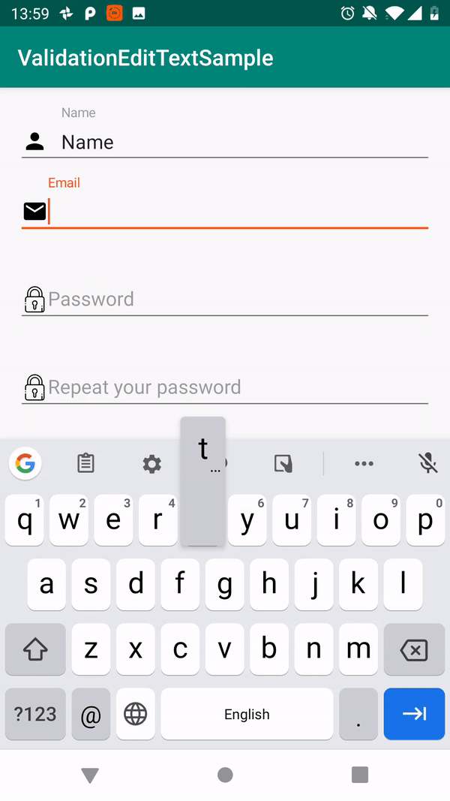

## **ValidationEditText**[  ](https://bintray.com/vitaliyptitsyn/maven/validationedittext/_latestVersion)
This is a simple library that facilitates text validation and error handling in a user-friendly way
on EditText with (TextInputLayout support).
For MVVM + data binding stack

## **Integration**
To add `ValidationEditText` to your project, first make sure in root `build.gradle` you have specified the following repository:
```groovy
    repositories {
        jcenter()
    }
```
>***Note***: by creating a new project in Android Studio there will be `jcenter` repository specified by default, so you do not need add it manually.
Once you make sure you have `jcenter` repository in your project, all you need to do is to add the following line in `dependencies` section of your project `build.gradle`.
See the latest library version [  ](https://bintray.com/vitaliyptitsyn/maven/validationedittext/_latestVersion)
```groovy
implementation 'com.github.vitaliyptitsyn:validationedittext:X.X.X'
```

## **Usage description**
Usage of `ValidationEditText` is quite simple. Just like regular data binding events. Need to bind LiveData that connect model with UI and provide validation rules.
#### **binding**
You can connect with ui in 2 ways: by `VET_validation_result` or `VET_validation_text`.
In `VET_validation_text` you will have text from the view, and only user error will be shown.
In `VET_validation_result` yo have to bind `ValidateResult` in you live data. And 
`app:VET_validation_result="@={vm.liveName}` at layout. 
```kotlin
data class ValidateResult(
    val originalText: String, //Text delivered to View   app:VET_validation_result="@={vm.liveName}"
    val errorText: String? = null, //Text shown on  the view. 
    val isValid: Boolean = false
)

```
#### **rules**
There are 2 ways to provide rules: 
    To provide the list `VET_validationRules` that accepts `List<ValidationRule>` (List of validator may dynamic)
    Or Use list attributes for common validator. You can combine them differently. (Validators from the xml)
    
```xml
        <data>
            <import type="com.pvitaliy.validationtext.rules.ContentValidation" />
        </data>

        <com.google.android.material.textfield.TextInputEditText
                        <!--    ...     -->
                  app:VET_show_error_mode="@{vm.liveShowOnEdit}"
                  app:VET_validation_content="@{ContentValidation.NOT_EMPTY}"
                  app:VET_validation_result="@={vm.liveName}"
                  tools:text="18,6" />
```
Validator text:
Name|Behavior
----|-------------- 
`VET_validation_content`|Take `ContentValidation` field Email or NotEmpty.
`VET_validation_length_min VET_validation_length_max` (may accept only one)| Validate min and max Length
`VET_validation_rule`| Take 1 custom rule
`VET_validate_equal` (optional)`VET_validate_equal_on_both`| Take another View, to compare text equality. If `VET_validate_equal_on_both=@{true}` error will be delivered to both views.

## **Error showing**
You can customize error showing on user view by choosing one ErrorMode. Also you can dynamically change error mode.
For example. When user clicks on Sing up need to validate input (email, and password) and show exception to user.
To do it set `VET_show_error_mode` to `ErrorMode.Once`, validation will be immediately triggered and after change validation mode to `nextMode` from the validator (see the sample project)

Name| Behavior
---- | --------------------------- 
`ErrorMode.None`| Error is not shown on EditText.
`ErrorMode.OnUserInput`| Shown only when view has focus and  on user\'s typing.
`ErrorMode.Always`| always validates result (Event if you send value in runtime).
`ErrorMode.Once`| The most interesting format. It validates text once, than sets mode accordingly to `nextMode` field.

#### **Customize error  and message**
To make you own validation Rule, implement `ValidationRule` and throw `ValidationException` in validate func when the validation failed.
Then `ValidationConverter` handles the error and shows it on the `EditText`.
ValidationException  has 3 child classes.  
In custom validation rules, the handiest way is to throw `ResException` or `StringException`

```kotlin
open class ErrorCodeException(
    open val errorCode: Int,
    open vararg val args: Any?
) : ValidationException()

open class StringException(val reason: String) : ValidationException()

open class ResException(
    @StringRes val resString: Int,
    vararg val args: Any?
) : ValidationException()
```
 To override error message, provide custom `ValidationConvector` by `VET_validation_converter`

### **License**
    Copyright 2019 Vitaliy Ptitsyn
   
    Licensed under the Apache License, Version 2.0 (the "License");
    you may not use this file except in compliance with the License.
    You may obtain a copy of the License at
    
        http://www.apache.org/licenses/LICENSE-2.0
    
    Unless required by applicable law or agreed to in writing, software
    distributed under the License is distributed on an "AS IS" BASIS,
    WITHOUT WARRANTIES OR CONDITIONS OF ANY KIND, either express or implied.
    See the License for the specific language governing permissions and
    limitations under the License.

